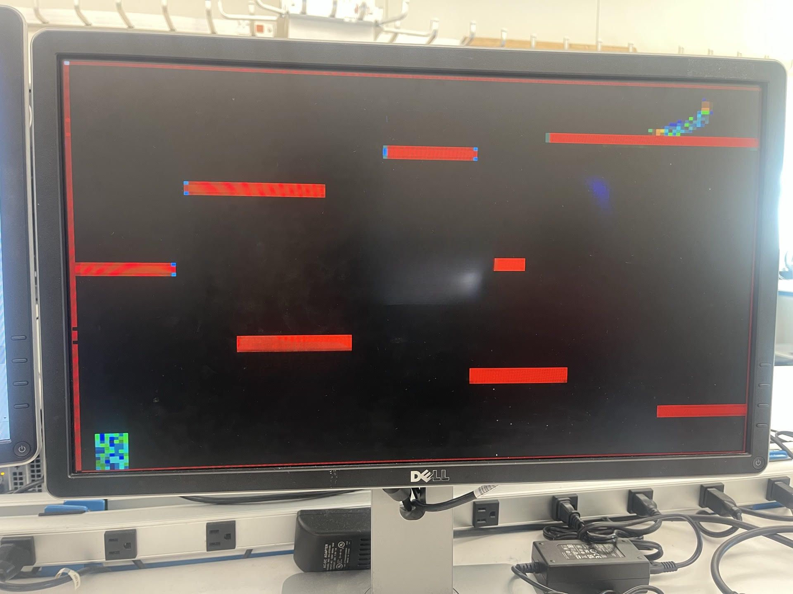

# 2-D Platformer Video Game 
ECE 287 Final Project for Jamieson's Section C  
**Authors: Drew Zabkar ('27) & Ben Barker ('24)**  
## Project Description  
Our project attemps to implement a VGA output that displays a character that changes position through a Finite State Machine that implements a VGA Driver. The character must jump on platforms to reach the top and win the game. The project is not working in its current state. At this point we are unable to figure out how to properly use the VGA driver to change the position of our shape accurately. 
## Background Information
Initially, we wanted to recreate the game 2D platformer Donkey Kong. In a 2D platformer video game a player controls a character navigating a two dimensional enviroment. This typically involes moving right, left, up, or down. 
## Design 
Below is is chronogically listed the order that we created various parts of our projects. Refrences are cited where applicable.  
#### VGA Frame driver
We used a MATLAB image to .mif converter file to convert our initial game image to a .mif file. We then use the VGA Frame driver borrowed from Dr. Peter Jamieson's VGA examples in the files section on Canvas to display our image to the screen. This worked very well and we were able write the file to the screen accurately. Below is an image of a the first photo we were able to load to the project.  

  

#### gameDesign Module  
Our gameDesign module was the next module we implemented. We coupled this module with an instance of the VGA Driver module in order to attempt to move the character in the bottom left corner. We implemented the use of KEY[1] as move right, KEY[2] as move left and KEY[3] as jump. 

We ran into issues updating our character position to make it move right, left and up. When we pressed a key value we ran into various different errors. Below is what we called a "snowflake error."   

